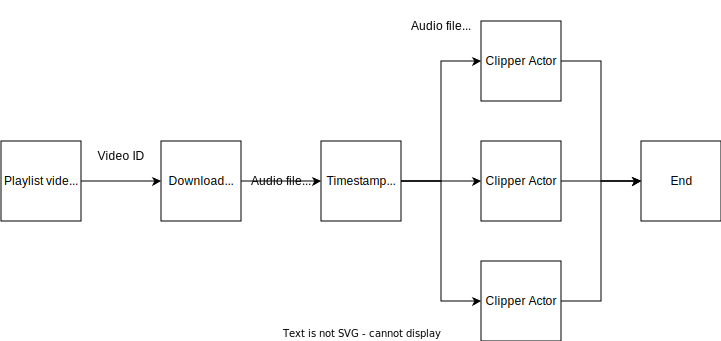

# gawr

[](https://github.com/nicomem/gawr/actions/workflows/ci.yml)

An audio archiver tool to create an audio library out of web videos. Download, clip, and normalize audio streams

## CHANGELOG

Please see the [CHANGELOG](CHANGELOG.md) for a release history.

## Documentation quick links

* [Pre-requisites](#pre-requisites)
* [How to build & run](#how-to-build--run)
* [Configuration](#configuration)
* [How it works](#how-it-works)
* [Contributing](#contributing)

## Pre-requisites

- A Rust environment to build the project
  - Latest stable and above is supported. May or may not work on previous versions
- Either `yt-dlp` or `youtube-dl`
- `ffmpeg`

## How to build & run

```bash
# To run locally
cargo build --release
cargo run --release -- --help

# To install & run from anywhere
cargo install --path .
cd /some/where/under/the/rainbow
gawr --help
```

## Configuration

This tool has multiple ways to be configured:

- [Command line arguments](#command-line-arguments)
- [Environment variables](#environment-variables)
- [Configuration file](#configuration-file)

If a configuration variable is present in multiple of those locations, the priority is the following: `Command line arguments` > `Environment variables` > `Configuration file` > `Default values`.

### Command Line Arguments

Available command line arguments can be checked with the `--help` argument :

```
An audio archiver tool to create an audio library out of web videos. Download, clip, and normalize audio streams

Usage: gawr [OPTIONS]

Options:
      --config <config>          The path to the TOML config file [default: .gawr.toml]
      --id <id>                  The IDs of playlists or videos
      --out <out>                The path to the output directory
      --cache <cache>            The path to the cache file, avoiding processing multiple times the same videos
      --split <split>            Either keep the entire video or create clips based on timestamps in the description [possible values: full, slow]
      --ext <ext>                The file extension to use for the output files. Defines the file container format to use [possible values: mka, mkv, ogg, webm]
      --clip_regex <clip_regex>  Regular expressions to extract timestamps from description.
                                 Must capture `time` and `title` groups (starting timestamp & clip title).
                                 
                                 For every description line, every pattern will be tested until one matches.
                                 A default pattern that should handle most cases is used if none is provided.
                                 
                                 Must use the [Regex crate syntax](https://docs.rs/regex/latest/regex/#syntax)
                                 
      --shuffle                  Randomize the order in which the videos are downloaded. Do not influence how clips are processed
      --cores <cores>            Assume the machine has this number of cores. Used to modify the number of worker threads spawned.
                                 
                                 When using a value of 0 (default), auto-detect the number of cores from the system
                                 
      --log <log>                The logging level to use [possible values: ERROR, WARN, INFO, DEBUG, TRACE]
      --bitrate <bitrate>        The audio bitrate to use for output files. Must follow the `ffmpeg` bitrate format
  -h, --help                     Print help
  -V, --version                  Print version
```

### Environment Variables

Configuration variables can also be set using environment variables.

To do so, simply add the `GAWR_` prefix and uppercase the variable.
For example `GAWR_CLIP_REGEX=...`.

### Configuration File

Finally, environment variables can be set using a [TOML](https://toml.io/) file.
By default, the one read is `.gawr.toml` but this can be set using the `--config` command line argument.

```toml
# Required variables (dummy template values)
id = ["<ID>", "<ID>"]
out = "<PATH>"
cache = "<CACHE>"
split = "<clips|full>"

# Optional variables (default values)
bitrate = 96
clip_regex = [
    "^(?:\\d+\\. *)?(?P<time>[0-9]+(:[0-9]+)+) *.? +(?:[0-9]+(:[0-9]+)+)? *.? +(?P<title>.+)$",
    "^(?:\\d+\\. *)?(?P<title>.+) *.? +(?P<time>[0-9]+(:[0-9]+)+) *.? +(?:[0-9]+(:[0-9]+)+)?$",
]
cores = 0
ext = "ogg"
log = "info"
shuffle = false
```

## How it works

### Short version

- The tool downloads audio streams, potentially clip them and apply audio normalization before saving them
- All of this is done on multiple threads to minimize the time downloading / processing
- It saves the current state in a sqlite local database to be able to restart at any time without re-doing work it has already done

### Long version

#### Configuration & Initialization

This is where the tool starts and:
- parse the command line arguments
- read the environment variables and configuration file
- combine all of them and verify all conf variables are valid and the required ones have been specified

Then:
- checks if the external programs are present (`yt-dlp` or `youtube-dl`, and `ffmpeg`)
- initializes the [actors](#the-actors)

### The actors

The main processing loop is structured using an [actor model](https://en.wikipedia.org/wiki/Actor_model) as schematized below :



1. The list of playlist video IDs is downloaded, and compared to the sqlite cache database to see whether there are new video stream to download

2. Each of these video IDs is sent to the *Download Actor* which downloads the video audio stream and passes them to the next actor

3. The *Timestamp Actor* parses the video description to detect timestamps in the video. It then passes each video section (a start time, and an end time) to one of the next actors

4. The *Clipper Actors* clips the audio file to keep only the wanted video section, applies audio normalization and other `ffmpeg` conversions to get the output clip audio file

The actor model is useful here since it allows each actor to run on its own thread and thus to optimize the work done conurrently :

- As soon as the *Download Actor* has passed the audio file to the next actor, it will begin downloading the next one.
- Timestamps for different audio files can be processed at the same time

### When things go bad

As this tool uses external programs, which communicate through the network, potentially using non-standard APIs... errors are bound to happen.

A lot has been done to handle as best as possible failures:

- Retry operations
- Detect unavailable video streams
- Process files using temporary files, to avoid trashing the output directory in case of crash/failure
- Save current state to handle unexpected crashes of the tool

At this point, the tool can be expected to work decently for personal usage, and should not require manual fiddling to put it out of a trash state. (but if that happens, feel free to create a new issue)

## Contributing

Feel free to create issues and/or submit pull request. I cannot guarantee how long it would take to solve/review them as it depends on how busy I am at the moment.
